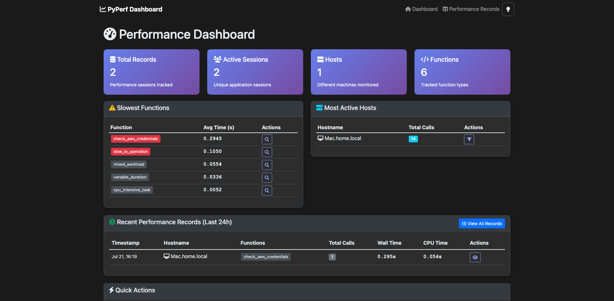
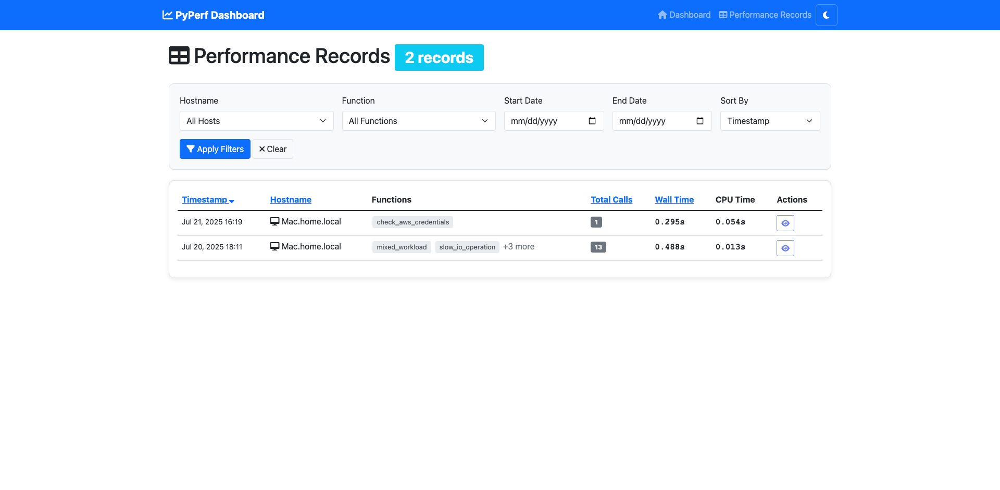
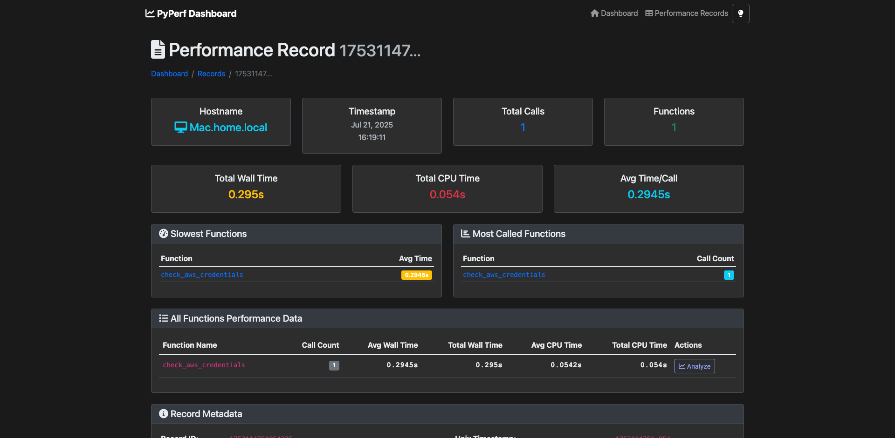
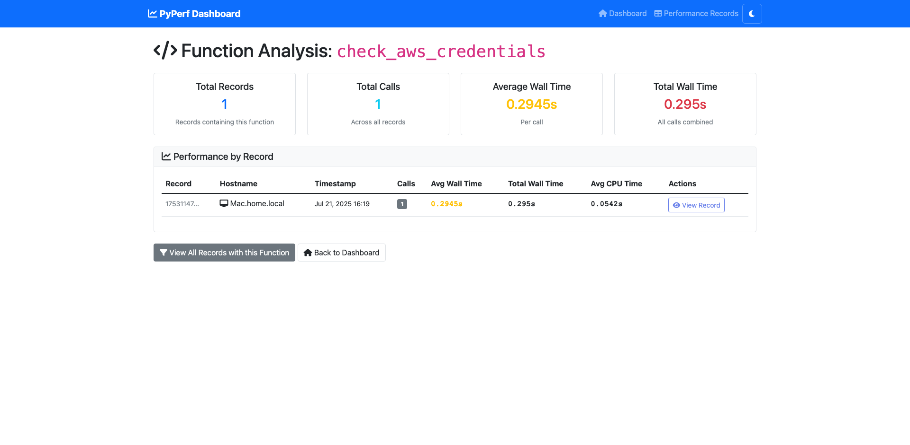

# py-perf-viewer

A comprehensive Django web dashboard for visualizing and analyzing performance data collected by the [py-perf](https://pypi.org/project/py-perf-jg/) library.

## Features

- **Real-time System Monitoring**: Live CPU, memory, and process metrics with 1-minute updates
- **Performance Analytics**: Function-level performance tracking and analysis
- **Time-series Visualization**: Interactive charts with Chart.js for historical trends
- **Optimized Data Storage**: Efficient DynamoDB queries with automatic 30-day TTL
- **Dark/Light Themes**: Modern UI with persistent theme preferences
- **REST API**: Programmatic access to all metrics and data

## System Monitoring Dashboard

The system monitoring features provide real-time insights into your infrastructure:

### System Overview
- **Host Status**: Real-time online/offline status with 6-minute timeout threshold
- **Resource Metrics**: Live CPU and memory utilization percentages
- **Timeline Data**: Historical performance data with 1-minute precision
- **Auto-refresh**: Automatic updates every 2 minutes

### System Detail Views
- **Interactive Charts**: Zoom controls (1m, 5m, 15m, 1h, 6h, 24h, All)
- **Real-time Updates**: Live data streaming with polling
- **Memory Calculation**: Uses `(total - available) / total * 100` formula
- **Time Formatting**: Consistent HH:mm:ss CDT format with 45-degree rotation

### Data Architecture
- **Optimized Storage**: py-perf-system-v2 table with hour-based partitioning
- **Automatic TTL**: 30-day data retention with DynamoDB TTL
- **Frontend-ready Format**: Pre-processed data requiring minimal computation
- **Efficient Queries**: Hour-based partition keys for fast retrieval

### Screenshots

### Main Dashboard Home (Dark Mode - Default)

*System overview with host status, resource metrics, and recent activity*

### Performance Records List (Light Mode)

*Paginated list of all performance records with filtering and sorting capabilities - Light mode offers a clean, professional appearance*

### Individual Record Detail (Dark Mode)

*Detailed view of a specific performance record showing function-level breakdown with dark theme*

### Function Analysis View (Light Mode)

*Cross-record analysis of specific functions with performance trends over time in light mode*

### Theme Toggle
The dashboard includes a convenient dark/light mode toggle in the top-right navigation:
- **🌙 Default**: Starts in dark mode with modern styling
- **💡 Toggle**: Click to switch between themes instantly  
- **💾 Persistent**: Your theme preference is saved across sessions

### REST API Endpoints

The dashboard also provides JSON API endpoints for programmatic access:

#### Performance Metrics API
`GET /api/metrics/` - Summary performance metrics in JSON format

```json
{
    "total_records": 2,
    "total_sessions": 2,
    "unique_hostnames": ["Mac.home.local"],
    "unique_functions": [
        "slow_io_operation",
        "cpu_intensive_task", 
        "check_aws_credentials",
        "mixed_workload",
        "fast_calculation",
        "variable_duration"
    ],
    "avg_session_duration": 0.0,
    "slowest_functions": [
        ["check_aws_credentials", 0.294],
        ["slow_io_operation", 0.105],
        ["mixed_workload", 0.055]
    ],
    "most_active_hosts": [
        ["Mac.home.local", 14]
    ]
}
```

#### Hostnames API
`GET /api/hostnames/` - List of unique hostnames for filtering

```json
{
    "hostnames": ["Mac.home.local"]
}
```

#### Functions API
`GET /api/functions/` - List of unique function names for analysis

```json
{
    "functions": [
        "check_aws_credentials",
        "cpu_intensive_task",
        "fast_calculation",
        "mixed_workload", 
        "slow_io_operation",
        "variable_duration"
    ]
}
```

## Features

- **Performance Overview**: Dashboard showing key metrics and trends
- **Function Analysis**: Detailed analysis of individual function performance
- **Record Browser**: Browse and filter performance records
- **Timeline Viewer**: Visualize system and process performance over time with interactive charts
- **REST API**: Programmatic access to performance data
- **Real-time Data**: Automatically displays latest performance data from DynamoDB or local storage

## Quick Start

### 1. Install Dependencies

```bash
# Create virtual environment
python3 -m venv venv
source venv/bin/activate  # On macOS/Linux
# or
venv\Scripts\activate     # On Windows

# Install requirements
pip install -r requirements.txt

# For development
pip install -r requirements-dev.txt
```

### 2. Configure PyPerf

Create a `.py-perf.yaml` configuration file in the project root:

```yaml
py_perf:
  enabled: true

# For local development (no AWS required)
local:
  enabled: true
  data_dir: "./perf_data"
  format: "json"

# For production with AWS DynamoDB
# aws:
#   region: "us-east-1"
#   table_name: "py-perf-data"
```

### 3. Start the Dashboard

```bash
./start_viewer.py
```

Visit http://localhost:8000 to view the performance dashboard.

## Integration with PyPerf Core Library

This dashboard works with data collected by the [py-perf](https://pypi.org/project/py-perf-jg/) core library:

```python
from py_perf import PyPerf

# Initialize performance tracking
perf = PyPerf()

@perf.time_it
def my_function():
    # Your application code
    pass

# Data is automatically collected and can be viewed in this dashboard
```

## Project Structure

```
py-perf-viewer/
├── pyperfweb/              # Django project
│   ├── dashboard/          # Main dashboard app
│   │   ├── views.py       # Dashboard views
│   │   ├── models.py      # Data models
│   │   ├── services.py    # DynamoDB service
│   │   ├── templates/     # HTML templates
│   │   └── tests.py       # Unit tests
│   ├── settings.py        # Django settings
│   └── urls.py            # URL configuration
├── manage.py              # Django management
├── requirements.txt       # Production dependencies
└── requirements-dev.txt   # Development dependencies
```

## Development

### Running Tests

```bash
# Unit tests (quiet mode, recommended)
python manage.py test pyperfweb.dashboard.tests --settings=pyperfweb.test_settings

# Unit tests (verbose mode, for debugging)
python manage.py test pyperfweb.dashboard.tests

# Integration tests (requires running Django server)
python test_django_server.py
```

### Code Quality

```bash
# Format code
black pyperfweb/
isort pyperfweb/

# Lint code  
flake8 pyperfweb/
mypy pyperfweb/
```

## Timeline Viewer

The Timeline Viewer provides interactive visualization of system and process performance metrics:

- **System Monitoring**: View overall system CPU and memory usage as a shaded background area
- **Process Tracking**: Overlay specific Python process performance on top of system metrics
- **Interactive Charts**: Switch between CPU and memory views, select specific processes
- **Correlation Analysis**: Identify when system load impacts Python application performance

To collect system monitoring data, use the PyPerf SystemMonitor:

```python
from py_perf import SystemMonitor, ProcessTracker

# Create and start monitoring
monitor = SystemMonitor(sample_interval=0.5)
monitor.start_monitoring()

# Track processes
tracker = ProcessTracker(monitor)
tracker.track_current_process()

# Your code here...

# Stop and save
monitor.stop_monitoring()
monitor.save_timeline_data()
```

## Configuration

The dashboard uses the same configuration system as the core py-perf library. See the [py-perf documentation](https://github.com/jeremycharlesgillespie/py-perf) for detailed configuration options.

## API Endpoints

- `GET /api/metrics/` - Performance metrics summary
- `GET /api/hostnames/` - List of unique hostnames
- `GET /api/functions/` - List of unique function names
- `GET /api/timeline/` - System and process timeline data for visualization
- `GET /records/` - Browse performance records
- `GET /functions/{name}/` - Function-specific analysis
- `GET /timeline/` - Interactive timeline viewer for system monitoring data

## Deployment

### Docker (Recommended)

```bash
# Build Docker image
docker build -t py-perf-viewer .

# Run with environment variables
docker run -p 8000:8000 \
  -e AWS_DEFAULT_REGION=us-east-1 \
  -e DYNAMODB_TABLE_NAME=py-perf-data \
  py-perf-viewer
```

### Traditional Deployment

1. Set up a production WSGI server (gunicorn, uWSGI)
2. Configure static file serving
3. Set up database (if using Django models)
4. Configure environment variables for AWS access

## Related Projects

- **[py-perf](https://pypi.org/project/py-perf-jg/)** - Core performance tracking library
- **[py-perf GitHub](https://github.com/jeremycharlesgillespie/py-perf)** - Core library source code

## License

MIT License - see LICENSE file for details.